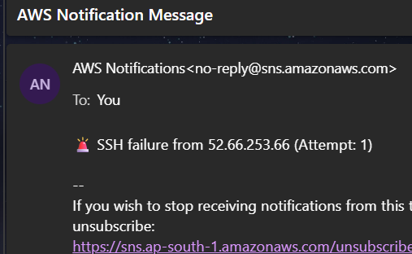

Absolutely, Vaibhavi! Here's your **📘 *Visual README.md*** for the project **“Wrong PEM SSH Detector with IP Blocking using AWS Network ACL + SNS”**, written in a visually engaging format with emojis, terminal-style commands, markdown badges, and clear sections — **ready to upload to GitHub**.

---

````markdown
# 🔐 Wrong PEM SSH Detector + IP Blocking with AWS Network ACL + SNS

🚨 Detect unauthorized SSH login attempts using a **wrong `.pem` file**, block the IP using **VPC Network ACL**, and send **real-time SNS alerts** – all in a single bash script!


---

## ⚡ Overview

> Monitors failed SSH login attempts in `/var/log/auth.log` (or `/var/log/secure`), tracks suspicious IPs, and blocks them in **AWS VPC Network ACL** if they exceed a failure threshold. Also sends an **email alert** using **SNS**.

---

## 📦 Features

✅ Detects SSH failures (wrong `.pem`, password, closed connections)  
✅ Tracks attempts per IP with a rolling time window  
✅ Auto-blocks IP using VPC **Network ACL entries**  
✅ Sends SNS alerts with IP, reason, timestamp  
✅ Logs all actions for auditing  
✅ Designed for Ubuntu / Amazon Linux  
✅ `systemd` compatible for auto-start  

---

## 🧰 Tech Stack

| Component     | Usage                         |
|--------------|-------------------------------|
| **EC2**       | Host & monitoring             |
| **SNS**       | Email alerts                  |
| **Network ACL** | Blocking malicious IPs       |
| **IAM Role**  | Permissions to manage NACL/SNS|
| **Bash Script** | Monitoring logic             |

---

## 🛠️ Setup Instructions

### 📁 Step 1: Install Script

```bash
sudo cp ssh_nacl_watcher.sh /opt/
sudo chmod +x /opt/ssh_nacl_watcher.sh
````

📌 Update inside script:

* `SNS_TOPIC_ARN`
* `NACL_ID`
* `REGION`

---

### ⚙️ Step 2: Create systemd Service

```bash
sudo nano /etc/systemd/system/ssh-nacl-watcher.service
```

```ini
[Unit]
Description=SSH VPC IP Blocker
After=network.target

[Service]
ExecStart=/opt/ssh_nacl_watcher.sh
Restart=always

[Install]
WantedBy=multi-user.target
```

```bash
sudo systemctl daemon-reload
sudo systemctl enable ssh-nacl-watcher
sudo systemctl start ssh-nacl-watcher
```

---

### 📧 Step 3: Set Up SNS

1. Go to **AWS SNS Console**
2. Click **Create Topic** → Type: `Standard`
3. Name: `ssh-failed`
4. Subscribe your email

---

### 🔐 Step 4: IAM Role for EC2

Attach this policy to your EC2 instance’s IAM Role:

```json
{
  "Version": "2012-10-17",
  "Statement": [
    {
      "Effect": "Allow",
      "Action": [
        "sns:Publish",
        "ec2:CreateNetworkAclEntry",
        "ec2:DescribeNetworkAcls"
      ],
      "Resource": "*"
    }
  ]
}
```

---

## 🧪 Testing

> Try SSH login with wrong `.pem` from another instance:

```bash
ssh -i wrong.pem ubuntu@<your-ec2-ip>
```

🧨 After 3 failed attempts in 3 minutes:

* ✅ IP will be blocked in NACL (port 22 denied)
* 📩 SNS alert will be sent to your email
* 📜 Logs saved in `/var/log/ssh_monitor.log`

---

## 📄 Logs

| File                       | Description           |
| -------------------------- | --------------------- |
| `/var/log/ssh_monitor.log` | All activity logs     |
| `/var/log/blocked_ips.log` | Confirmed blocked IPs |

---

## 🔄 Reset or Unblock

To remove IP from NACL:

```bash
aws ec2 delete-network-acl-entry \
  --network-acl-id acl-xxxxxx \
  --rule-number 123 \
  --ingress \
  --region us-east-1
```

Clear logs:

```bash
sudo rm /var/log/blocked_ips.log
```

---

## 📈 Future Enhancements

* Auto-expire blocked IPs after N hours
* Slack/Discord alert integration
* CloudWatch integration
* Block using Security Groups or AWS WAF
* Real-time Web UI Dashboard

---

## 📷 Screenshots (Optional)

> Add:

* NACL rule screenshot


* SNS email sample


* CLI terminal output


---

## 👤 Author

**Vaibhavi Khatri**
Devops & Cloud Enthusiast ☁️
📧 [vaibhavikhatri21004@gmail.com](mailto:vaibhavikhatri21004@gmail.com)

---

## 📎 License

This project is open-source and free to use for learning or internal tools.

---

```

---
